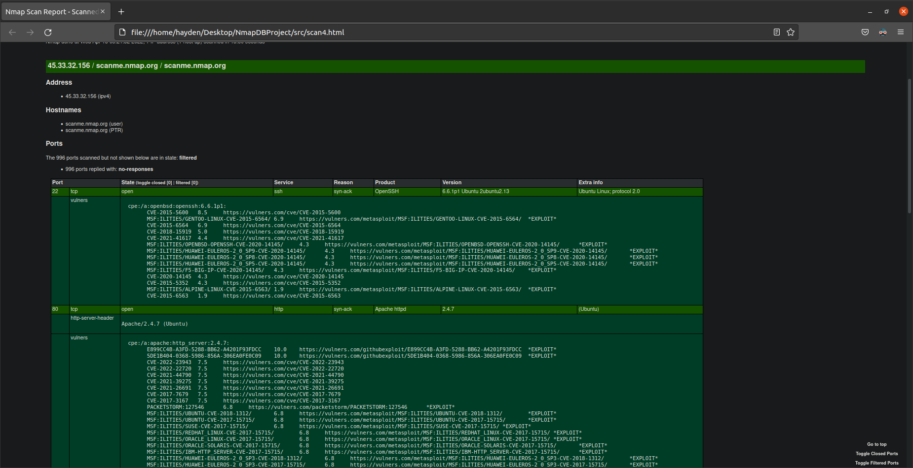

GUIMap Proposal
=======================

- **Project Date**: April 13, 2022

- **Student Name**: Hayden Ackerman

- **Major**: Cybersecurity

- **Degree**: Bachelor of Science

- **Advisor Name**: Dr. Sean Hayes


Problem Statement
-----------------

The [Nmap scanning engine](https://en.wikipedia.org/wiki/Nmap) is a valuable
tool for anyone who wants to find out more about their own network, perform
reconnaissance against a target, or learn more about networking in general.
Ideally, Nmap supports the ability to upload to various database schemas. Users
would be able to retrieve current and past information about scans, using an
intuitive graphical user interface (GUI). An analysis of the tool reveals that
Nmap itself possesses no such functionality. The developer of Nmap even states on [his
website](https://nmap.org/), "Nmap offers no direct database output
functionality. Not only are there too many different database types for me to
support them all, but users' needs vary so dramatically that no single database
schema is suitable." Yet, there is a cross-platform GUI for Nmap called "Zenmap"
that possesses the capability to upload results to a local database. However,
the database is...functional at best, and the GUI is completely unintuitive. How
is an individual user or even an international enterprise supposed to easily
store their scan results? I propose a tool that utilizes an intuitive GUI and an
easily extensible database library/framework to complement the Nmap scanning
engine. This tool would be a valuable addition to anyone's toolkit. Furthermore,
this tool would provide the user with easy access to their data and an intuitive way to visualize it. Yet, at the same time it would be a lightweight package that would work on most operating systems.

Description of Project
----------------------

My project will be a graphical user interface (GUI)-focused implementation of
the Nmap "Network Mapper" scanning tool. It will receive input (e.g., flags,
IPs/URLs, and so forth) from the GUI and pass it to the Nmap engine. Output can
either be displayed immediately or directly submitted to a database of the
user's choosing for future examination. If a database does not exist yet, the
tool also supports the capability of creating a database for the user. If a
database already exists, the tool can pull down previous scanning results and
convert them into a comma separated values (CSV) file. Additionally, the user will be able to interact with the database itself.
The user will be able to sort the data
in the database, delete data in the database, edit data,
and potentially merge data in the database. Furthermore, all
data that the database
possesses will be visualized using Xsltproc, a command-line XSLT processor.

Proposed Implementation Language(s)
-----------------------------------

My project will use Python 3 for most of the heavy lifting. Python 3 is a
powerful, yet easily modifiable and implementable language. It has numerous
libraries and can easily interact with other programming languages. The backend,
i.e., the database, will be communicated with via SQL queries using SQLite as a
medium. SQL is a standard language for storing, manipulating, and retrieving
data in databases. SQLite is a C-language library that is a small, fast,
self-contained, high-reliability, full-featured, SQL database engine, according
to their [website](https://www.sqlite.org/index.html).

Libraries, Packages, Development Kits
-------------------------------------

1. **PySimpleGUI**

    - a Python framework meant to streamline the building of GUIs with pure code.

2. **SQLite**

    - a C-language library that is a small, fast, self-contained,
        high-reliability, full-featured, SQL database engine.

3. **SQLalchemy**

    - a Python SQL toolkit and Object Relational Mapper, allowing for
        efficient and high-performance database access.

4. **Xsltproc**

   - a command-line XSLT processor used to transform .xml files.

5. **Ansible**

   - a software-automation suite that utilizes "playbooks" to configure environments for software.

Software/Equipment Needed
-------------------------

1. **Nmap**

    - The tool my project is interacting with.

2. **Text Editor**

    - Needs to have the capability to display a CSV file, also required to
        display scanning reports.

3. **Oracle's VirtualBox**

    - Needed for development inside Linux.

4. **Ubuntu Linux** *(potentially Windows 10 with Windows Subsystem for Linux
    (WSL) 2)*

    - Needed for development and testing purposes.

5. **Python 3**

    - Needed to develop and run the application.

6. **Visual Studio Code**

   - IDE needed to code the project.

7. **Xsltproc**

   - Needed to transform the .xml file into a human-readable format.

8. **Ansible**
   
   - Needed to set up the environment for the program to run.

Motivation
----------

I decided to take on this project for several reasons:

1. I wanted to delve deep into the Python programming language. My first
    experience with Python was with making basic scripts for games when I was
    younger. My first collegiate experience with Python was in Survey of
    Scripting. In that class, I appreciated the raw power yet simplicity of the
    language as a whole. By taking on this project, I would like to be able to
    call myself a Python "guru".

2. I am a Cybersecurity major. In whatever profession I choose, I will most
    likely use Nmap at some point or another. It has been an invaluable boon to
    the Information Security (InfoSec) field. I would like to find out the sheer
    capabilities of the tool and doing so would only increase my appreciation
    for the InfoSec field. Additionally, I would like to be able to use my own
    tool in my profession.

3. The Nmap tool needs to be able to upload information to various database
    schemas/schemaless databases. Nmap would benefit from the capabilities and
    general uniformity that a powerful database engine, such as SQLite,
    possesses.

Research & Background
---------------------

This project was completed by utilizing the skills acquired from my academic development at CSU. The first phase
of the project involved surface-level research and testing of the components that make up the product.
This was important because I do not want to incorporate every possible Python library into my product.
If I am able to "cherry-pick" the ones I need, it would simplify development. The second phase
consisted of developing the requirements document. It took the overall general idea of the
project and organized it. The next phase was the most resource-heavy, being the phase
where an implementation of the project was constructed. Research was conducted to determine how the
program should be designed. Due to the program utilizing the PySimpleGUI library, this included testing
some of the demo programs that PySimpleGUI users have created. Bits and pieces were put together until
a functioning prototype was available. Although the prototype still has some bugs to be ironed out,
it is getting ever closer to a final product.

Requirements
------------

1. Functional Requirements
--------------------------

-   **Requirement ID**: 01a

    -   **Requirement Type**: Functions

    -   **Description**: This product shall initiate scans from the Nmap engine
        per the user's instructions and record all data into a database.

    -   **Originator**: Hayden Ackerman

    -   **Fit Criterion**: The user shall be able to easily (without external
        help) complete scans and view the results in a database.

    -   **Priority**: 5

-   **Requirement ID**: 01b

    -   **Requirement Type**: User Input

    -   **Description**: This product shall accept input from the user that will
        be parsed by the internal processes of the product.

    -   **Originator**: Hayden Ackerman

    -   **Fit Criterion**: The user shall be able to input their data into the
        product and the product follows the user's instructions.

    -   **Priority**: 5

-   **Requirement ID**: 01c
  
    -   **Requirement Type**: Scan Options: Profiles

    -   **Description**: This product shall have a pre-defined list of
        scan intensities (how forceful the scan is).

    -   **Originator**: Hayden Ackerman

    -   **Fit Criterion**: The user shall be able to choose the "Intense scan" option
        and the scan will complete faster than the "Quick scan" option.

    -   **Priority**: 5    

-   **Requirement ID**: 01d

    -   **Requirement Type**: Scan Options: TCP

    -   **Description**: This product shall accept input from the user that designates
        the type of TCP scan to be used.

    -   **Originator**: Hayden Ackerman

    -   **Fit Criterion**: The user shall put in one of the flags for the TCP scans and the scan
        will be completed with the user's parameters. 

    -   **Priority**: 5

-   **Requirement ID**: 01e

    -   **Requirement Type**: Scan Options: Special Scans

    -   **Description**: This product shall accept input from the user that will initiate
        one of the unique scans that Nmap is able to perform.

    -   **Originator**: Hayden Ackerman

    -   **Fit Criterion**: The user shall put in a unique flag (as in, a specialized flag)
        and the scan will be completed with the user's parameters. 

    -   **Priority**: 5

-   **Requirement ID**: 01f
  
    -   **Requirement Type**: Scan Options: Timing

    -   **Description**: This product shall give the user an option to delay scanning probes
        via pre-defined intervals of time. 

    -   **Originator**: Hayden Ackerman

    -   **Fit Criterion**: The user shall select the "10-minute" option, and it will be
        10 minutes before the next probe is sent out. 

    -   **Priority**: 5

-   **Requirement ID**: 01g
  
    -   **Requirement Type**: Scan Options: Checkboxes

    -   **Description**: This product shall have several checkboxes with unique pre-defined 
        functions: a FTP bounce attack, an Idle Scan, Services version detection, Operating
        system detection, and Disable reverse DNS resolution. 
    
    -   **Originator**: Hayden Ackerman

    -   **Fit Criterion**: The user shall check the checkboxes, and the current 
        Nmap command will reflect the user's choice.

    -   **Priority**: 5

-   **Requirement ID**: 01h
    
    -   **Requirement Type**: Scan Options: Target

    -   **Description**: This product shall have a text field that accepts either an IP address
        or a URL address from the user.

    -   **Originator**: Hayden Ackerman

    -   **Fit Criterion**: The user shall put "www.google.com" into the text field, and the product
        shall scan "www.google.com".

    -   **Priority**: 5

-   **Requirement ID**: 01i

    -   **Requirement Type**: Exporting Data

    -   **Description**: This product shall allow the user to retrieve all of
        their data that the product has stored and created.

    -   **Originator**: Hayden Ackerman

    -   **Fit Criterion**: The user shall run a scan and download the results
        from the product.

    -   **Priority**: 4

-   **Requirement ID**: 01j

    -   **Requirement Type**: Data Visualization

    -   **Description**: This product shall display the user's data in a format
        chosen by the user.

    -   **Originator**: Hayden Ackerman

    -   **Fit Criterion**: The user shall run a scan and view their data in a
        format they choose.

    -   **Priority**: 3

2. Look and Feel Requirements
-----------------------------

-   **Requirement ID**: 02

    -   **Requirement Type**: Appearance

    -   **Description**: This product's appearance shall be minimalistic and
        unobtrusive. It shall provide the user with complete control of the
        product.

    -   **Originator**: Hayden Ackerman

    -   **Fit Criterion**: On a Likert scale of 1 to 5 (5 being most
        aesthetically pleasing), polled users will average a rating of 3 or
        above.

    -   **Priority**: 3

3. Ease of Use Requirements
---------------------------

-   **Requirement ID**: 03

    -   **Requirement Type**: Useability

    -   **Description**: This product shall be used by people with basic
        knowledge of operating a computer program.

    -   **Originator**: Hayden Ackerman

    -   **Fit Criterion**: Someone unaware of the capabilities of the product
        shall be able to pick it up and use it to its full capabilities.

    -   **Priority**: 4

4. Performance Requirements
---------------------------

-   **Requirement ID**: 04a

    -   **Requirement Type**: Speed and Latency

    -   **Description**: This product will complete scans and upload data in a
        reasonable timeframe. Depending on the size of the network being scanned
        and the results being uploaded, a reasonable timeframe can be
        established to be \~\< 30 minutes.

    -   **Originator**: Hayden Ackerman

    -   **Fit Criterion**: The product shall complete scans and upload results
        in less than an hour.

    -   **Priority**: 3

-   **Requirement ID**: 04b

    -   **Requirement Type**: Precision or Accuracy

    -   **Description**: The scans from this product will depict network
        conditions with relative accuracy and the database will accurately
        record information.

    -   **Originator**: Hayden Ackerman

    -   **Fit Criterion**: On a network with 10 devices, scans will show all 10
        devices and the database will show all information for each device.

    -   **Priority**: 3

-   **Requirement ID**: 04c

    -   **Requirement Type**: Reliability and Availability

    -   **Description**: This product shall be freely available to the user and
        will run until the user chooses to terminate the product.

    -   **Originator**: Hayden Ackerman

    -   **Fit Criterion**: The product will run for 3 hours and will only
        terminate once the user presses the quit button.

    -   **Priority**: 2

-   **Requirement ID**: 04d

    -   **Requirement Type**: Scalability and Capacity

    -   **Description**: This product shall rely on dynamic scalability and
        capacity, defined by the user's parameters.

    -   **Originator**: Hayden Ackerman

    -   **Fit Criterion**: Starting at 1 scan result, the product will scale up
        to 1000+ results and the database will show all results.

    -   **Priority**: 4

5. Maintainability and Support Requirements
-------------------------------------------

-   **Requirement ID**: 05

    -   **Requirement Type**: Maintenance Requirements

    -   **Description**: Bug fixes and performance improvements must be able to
        be applied to the project as soon as they are available.

    -   **Originator**: Hayden Ackerman

    -   **Fit Criterion**: Bugs will be fixed and patches will be pushed out
        ASAP, and will be applied to the product.

    -   **Priority**: 1

6. Security Requirements
------------------------

-   **Requirement ID**: 06a

    -   **Requirement Type**: Access Requirements

    -   **Description**: This product shall provide users with the capability of
        locking their databases with passwords.

    -   **Originator**: Hayden Ackerman

    -   **Fit Criterion**: All users are able to password-protect their
        information.

    -   **Priority**: 5

-   **Requirement ID**: 06b

    -   **Requirement Type**: Integrity Requirements

    -   **Description**: The product shall prevent incorrect or harmful data
        from being introduced into the database.

    -   **Originator**: Hayden Ackerman

    -   **Fit Criterion**: Incorrect scan results and garbage data will be
        entered into the database, and will be rejected or corrected.

    -   **Priority**: 5

Project Implementation
----------------------
The initial setup of the program consists of either utilizing an existing Linux machine
or by using the custom iso built for this program. Then, the user must run
```
sudo apt-get update
sudo apt-get install ansible
```
(Ansible is already pre-installed on the custom iso).<br>
Download the `GUIMAP.zip` file, and the `guimap_playbook.yml`. Since this is
an Ansible playbook, you must use the `ansible-playbook` command to run it.
It would look like this: `ansible-playbook guimap_playbook.yml`. The playbook 
installs necessary packages and Python libraries for GUIMap to run properly. The
contents of the playbook looks like this: 
```
---
- hosts: 127.0.0.1
  connection: local
  tasks:
    - name: Install nmap, pip, python3.8, git, libcap2-bin, and xsltproc
      apt:
        pkg:
        - nmap
        - python3-pip
        - python3.8
        - git
        - libcap2-bin
        - xsltproc
    - name: Install necessary python libraries using pip
      pip:
        name:
          - PySimpleGUI
          - xmltodict
          - sqlalchemy
          - pandas
    - name: Creates a directory for GUIMap
      file: 
        path: ../Desktop/GUImap
        state: directory
    - name: Unzips GUIMap
      ansible.builtin.unarchive:
        src: ../Downloads/GUIMAP.zip
        dest: ../Desktop/GUImap
        remote_src: yes
``` 
Additionally, it creates a directory on the user's Desktop named `GUIMAP`, and
unzips the contents of `GUIMAP.zip` into it. After changing into the directory
and then the `src` subdirectory, the user is able to run the program by opening 
their preferred terminal and running `python3 GUIMap.py`. Once the main menu opens,
the user has complete control over the application, and can input whatever they wish
in the input fields. If they are unsure of the Nmap commands they should use, they
only need to press the Help button and a pop-up will list out the Nmap flags. 

Screenshots
-----------

#### Figure 1: Main Menu:


#### Figure 2: Help Section:


To use the application, the user must give Nmap something to scan. The user needs to 
enter either a URL
or an IP address in the Target(s) field, and then press Start. The user can see what 
the constructed
command will like, and the output of the command is piped to the multi-line window 
(See figure 3 for reference).

#### Figure 3: Normal Scan (No Flags):


These are the basic capabilities of the GUIMap program. Its main feature is that it 
allows for the output of files and the creation of a database. Additionally, it 
utilizes the `Xsltproc` processing engine to transform scan results into a `.html` 
file, viewable in the user's browser.<br><br>
To output a file, the user must check the checkbox "Output to an XML file?", and 
input a filename into the Filename (optional) field. Then, press Start (See figure 4 
and figure 5).

#### Figure 4: File Output:


#### Figure 5: Contents of the File:


To upload to a database, the user must either have a file ready to upload, or they 
must have one created by the file output function. The user checks the "Upload to a 
database?" checkbox, and inputs the name of the database to create (or to upload to 
if it already exists), the database table, and the filename of the file to upload.
Then the user presses Start (See figure 6, figure 7, and figure 8).

#### Figure 6: Upload to Database:


#### Figure 7: Database File:


#### Figure 8: The Database


However, the database that GUIMap creates is also scalable depending on the number 
of scanning results (See figure 9, this has nmap with flags that output a lot of
results, and see figure 10 for the scaled database).

#### Figure 9: Nmap with Noisy Flags:


#### Figure 10: Scaled Database:


If the user wants to more accurately visualize their data, they must either have a
scan to visualize or must output a scan to a file. Then, they must provide the
filename in the filename field, and check the "Visualize results?" checkbox. Then 
the user presses start. Once the scan finishes or the XSLTProc engine
finishes manipulating the file, the user's default browser will
open and will display the file. (See figure 11 and see figure 12).

#### Figure 11: Visualize Option


#### Figure 12: XSLTProc Visualizer:


Some scanning options in Nmap require root access. However, **this is a security risk**. Rather than giving
Nmap root access, GUIMap sets file capabilities for Nmap using the command `sudo setcap cap_net_raw,cap_net_admin,cap_net_bind_service+eip $(which nmap)`.
To do so, the user checks the checkbox "Give nmap elevated privileges?", and presses start. A bash terminal will open, asking for the user to enter
their root password. This is unfortunately where one of the bugs come into play. In a perfect scenario, the bash terminal opens and waits
for the user to enter their root password before continuing the program. However, the current implementation will ask for the root
password while the rest of the program continues to run in the background. No fix has been found yet, but if a user truly requires to run
privileged scans, they only need to enter their root password and re-run the scan (See figure 13, and figure 14).

#### Figure 13: Privileged Option:

(The command completes successfully for me because I already have file capabilities set for Nmap)

#### Figure 14: Bash Prompt:


A link to the GitHub repo can be found [here](https://github.com/HMAckerman/GUImap).

Test Plan
---------
1.  Overview  
    This test plan describes the testing approach and overall framework
    that will drive the testing of the GUIMap program.

2.  Goals  
    The goal of this test is to verify that the functionality of GUIMap
    works according to the specifications. The test will execute and
    verify test scripts, identify, fix, and retest all software bugs.

    The final product of the test is:

    -   A production-ready software.

    -   A user-friendly UI.

    -   A comprehensive graph that displays data pulled from the software.

    -   An Ansible automation script.

3.  Constraints  
    This test will suffer from time-based constraints. Additionally, it
    will suffer from the developer being unfamiliar with some software
    components. The developer will have to consult documentation to
    overcome these constraints.

## References

1.  Documents

This test utilizes two documents: [Requirements.md](Requirements.md) & [SeniorProjectProposal.md](SeniorProjectProposal.md)

## Test Items

1.  Software
    This test will utilize several different software products:

    -   SQLAlchemy 1.4.28
    -   Xsltproc
    -   SQLite 3.37.0
    -   Visual Studio Code 1.66.2

## Features to be Tested

1.  Tested Features

-   Nmap Scan Completion: All (applicable) flags of the nmap scanning
    engine will be used. Various networks will be scanned, including my
    home network, the university network, and potential virtual
    networks.

-   Xsltproc Data Visualization & Transformation: Scans will be visualized with the
    Xsltproc processing engine. Testing will begin with small scans,
    listing very few results. By the end of testing, the goal is to get
    large-scale scans transformed by Xsltproc. The user will be able
    to save their data.

-   Database Functionality: Scans will be saved to the database.
    Small-scale scan results will be the first to be implemented and
    then large-scale scanning results.

-   UI Functionality: The UI will be tested on a Likert scale. The exact
    scale has not been nailed down, however a scale is being developed
    based upon user feedback.

-   Ansible Automation Script: An Ansible Automation script will be
    configured to set up the ideal deployment environment. Common
    configurations are expected to be covered.

## Features Not to be Tested

All features will be tested.

## Approach

### Testing Methods

Testing will consist of a case-by-case basis. For example, say that
I start with the Nmap scanning function. If that passes, I move to
the next testing module. I will keep testing until I run into a bug
or fault. At that point, I will attempt to fix the bug/fault, and
start back over. This process will be repeated until the product is
capable of smoothly operating.

## Testing Levels

Component testing will be used to ensure that each individual piece of
the software functions according to specifications. Most testing will
be done via manual means, such as entering scan data and database
data. This will ensure that the entered data is controlled. At a point
in the testing, I will begin utilizing “unconventional” data, to test
the robustness of the product. If automated testing is available,
depending on usability, it may be integrated as well.

## Item Pass/Fail Criteria

-   Nmap (Pass): In a physical environment with access to other machines, the
    user verifies the Nmap scanning tool shows that at least one system
    is online. In a perfect environment, all network packets will go
    through; however, to maintain a realistic goal, at least 90% of all
    packets sent will go through. Furthermore, a typical scan will
    indicate whether a port is opened or closed.

-   Xsltproc (Pass): The Xsltproc processing engine is expected to show fine
    details of scanning results. These details are the type of scan
    conducted, the number of open and closed ports, how many packets
    were successfully sent through, and how many hosts were online.

-   SQLite Database (Pass): The SQLite database is expected to house all
    aspects of the scan results. The database will separate the scans
    into columns based upon the user’s desired headers for the table.
    The database will form itself around the user’s inputs.

-   UI Functionality (Pass): The UI will pass a Likert scale that is discussed
    by the course instructor and the student. The UI will present the
    user with fully functional input fields and buttons. The UI will be
    simple in design but powerful in functionality.

-   Ansible Automation Script (Pass): The Ansible Automation Script will
    configure a system with set parameters to run GUIMap. All the user
    must do is deploy the GUIMap script on the system and execute it.

-   Nmap (Fail): In a physical environment with access to other machines, the
    user verifies that the Nmap scanning tool fails to show that at
    least one system is online. In terms of network packets, unless
    proven to be a service fault or a network fault, no network packets
    are successfully sent (all packets are dropped). All scans fail to
    produce a list of opened or closed ports.

-   Xsltproc (Fail): The Xsltproc processing engine can hang if overwhelmed with an
    abnormally large .xml file. The user is unable to view their data.

-   SQLite Database (Fail): The SQLite database fails to house all aspects of
    the scan results, or the database is corrupted. The database lumps
    all scans into a single column. The database is unresponsive to user
    input.

-   UI Functionality (Fail): The UI does not reach a desired score on the
    Likert scale. All buttons and input fields are viewable but fail to
    function. The UI confuses the user and causes them to abandon the
    program.

-   Ansible Automation Script (Fail): The Ansible Automation Script fails to
    configure a system fit to run GUIMap. The user must configure every
    software package to execute GUIMap.

## Suspension Criteria and Resumption Requirements

### Suspension Criteria

Testing will be suspended upon encountering a notable decrease in
performance, a program-breaking bug, or segmentation faults. Another
suspension criteria is if assigned test resources are not available
when needed by the test team.

### Resumption Criteria

If testing is suspended, resumption will only occur when the
problem(s) that caused the suspension have been resolved. When a
critical defect is the cause of the suspension, the fix must be
verified by the testing team before testing is resumed.

## Test Deliverables

1.  Test Plan  
    This document itself is considered a test plan.

2.  Test Cases  
    Please reference [TestCases.xlsx](TestCases.xlsx).

3.  Test Scripts  
    No test scripts have been created yet.

4.  Defect/Enhancement Logs  
    No Defect/Enhancement logs have been created yet.

5.  Test Reports  
    No test reports have been created yet.

## Test Environment

### Hardware

Testing will be done on the following hardware specs:

-   AMD Ryzen 7 3700x CPU, 8c/16t @ 4.2GHz

-   Sapphire Pulse Radeon RX 5700, Driver Version 22.2.3

-   Corsair Vengeance RGB PRO 32GB (2x16GB) DDR4 3200MHz CL16 in
    Dual-Channel mode

### Software

Testing will be done with the following software:

-   Oracle Virtualbox Version 6.1.32 r149290 (Qt5.6.2)

-   Ubuntu Linux, version 20.04.3 LTS

-   Python 3.8.10

-   Nmap version 7.80

-   Microsoft Windows 10 Enterprise, 10.0.19044

### Network

Testing will be done with the following network settings:

-   Virtual NAT through Oracle Virtualbox

## Estimate

### Costs and Effort

Testing will not cost anything in a monetary sense. Testing will take at least 60+ hours of effort.

## Staffing and Training Needs

This testing does not require any special staffing or training.

## Responsibilities

This testing requires two team members to fulfill specialized roles:

-   Dr. Sean Hayes: Reviewing documentation, lead Quality Assurance
    engineer

-   Hayden Ackerman: Lead developer, tester, and documenter

## Risks

1. Risks  
   This test plan has some assumed risks:

    -   The project will not be completed in time

    -   Critical project-stopping bugs will happen

    -   Other schoolwork will take priority

    -   Data corruption leads to loss of the project

2. Mitigations  
    There are mitigations in place for the risks:

    -   Responsible time management will ensure that the project is
        completed in time

    -   Debugging will help narrow down problem pieces of code

    -   Balancing of schoolwork will ensure that equal attention is provided
        to the project

    -   Several backups will ensure that if any data corruption occurs, its
        effect will be minimal

## Assumptions and Dependencies

1.  Assumptions  
    This testing will have some assumptions:

    -   Constantly working on the project will not be possible

    -   Bugs will happen

    -   Deadlines will need to be extended

2.  Dependencies  
    This testing has some dependencies:

    -   Scanning cannot be completed without the Nmap engine

    -   Storage of scanning results cannot be completed without the database

    -   The project cannot be completed without an IDE

    -   The project cannot be completed without Python

    -   Scanning cannot be completed without a network

Challenges Overcome
-------------------
The overall biggest challenge was the time constraint. Balancing the project with other schoolwork was extremely difficult,
but the worst part about it was experiencing burnout. I had gotten to the point where I was working on my project so much that
I just lost overall interest, and had to actively force myself to work on it. It was horrible, because I enjoy programming.
Another big challenge was making the database scale with the number of scan results. Working with the .xml file format
was an absolute pain. It is overly convoluted, and is a displeasure to work with when you need to "cherry pick" certain
parts of the file. Finally, one of the more unexpected problems was subprocesses in Python. Subprocesses are a very useful way
to run other commands. However, it can be very dangerous too. Using `shell=True` in a subprocess call can lead to shell injection, so I had
to use the `shlex` library to split up commands. Furthermore, while the subprocess library is very useful, it needs to be
used in conjunction with other libraries to offer a more granular control method for the subprocesses. While the 
application is not 100% bug free, it is getting easier to fix the ones that do pop up.

Future Enhancements
-------------------

-  Add support for encrypting the database. SQLite does have the capability, but you have to pay a large amount of
   money for the enterprise edition in order to do so.

-  Properly implement a blocking mechanism to wait for the user to input their root password. Currently, the program
   continues to run, even if the user has not entered their root password.

-  Finish out all things listed in Requirements.md, such as checkboxes for various scans, 
